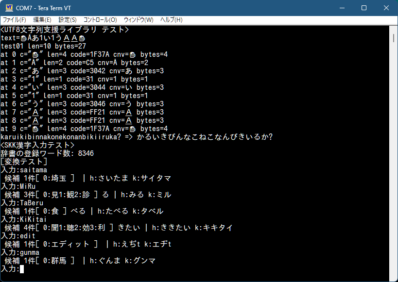
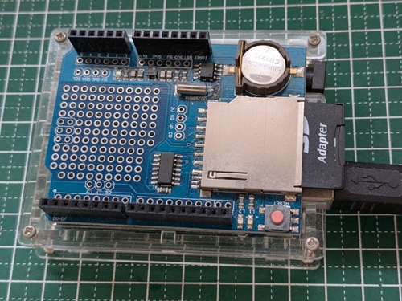

# arduino_skk

Arduino用日本語漢字変換ライブラリ V0.1  

## 概要

本ライブラリとサンプルスケッチは、Arduino Uno R3用の日本語変換を補助するライブラリです。  
実装には「かな漢字変換プログラム SKK」の辞書を利用しています。  
まだまだ、開発途中です(^^♪

※ 本ライブラリの実装にあたり、以下のコンテンツを利用及び流用させて頂いております。  
* SKK dictionary https://github.com/skk-dev/dict  
  SKK-JISYO.M (ミドルサイズ辞書)  

## 仕様
* 辞書データ：SKK辞書ファイル SKK-JISYO.M相当 (ミドルサイズ辞書)
* 辞書ファイルサイズ：211Kバイト
* 収録用語数： 8346ワード
* 収録文字コード：UTF-8

## ハードウェア環境
* マイコンボード: Arduino Uno R3
* データロガーシールド(SDカード用、SDカードモジュールでも可能)

## スケッチの使い方

SDカード利用のためのSPIのSS(CS)は、D10を指定しています。  
他のボード、異なるマイコンボードの場合は、
 arduino_skk.inoの  
  int32_t rc = skk.begin();  
を修正して
  int32_t rc = skk.begin(ポート番号);  
として下さい。

## 今後の計画

さすがに、Arduino Uno R3では、きびしいので、  
ESP32や、ラズパイpicoで、スタンドアロンでのお手軽漢字入力を出来ならいいな..  
を目指します(^^♪  

